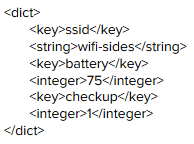
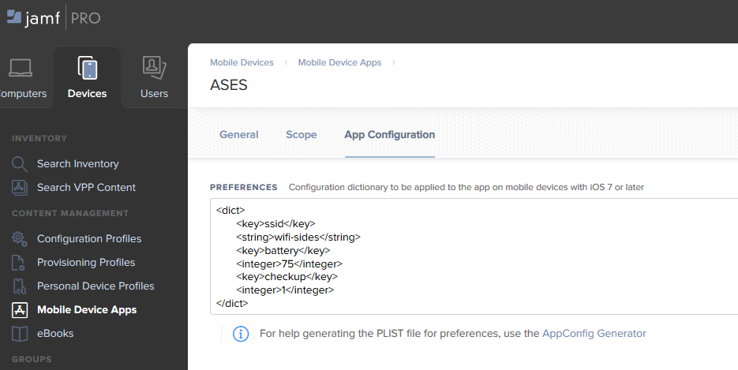

# ASES

Application permettant de passer des examens SIDES.

=> Permet à l'étudiant d'avoir accès au contrôle de luminosité de la tablette puis de modifier l'orientation de cette dernière tout en la bloquant (le bouton physique permettant de verrouiller l'orientation n'existant plus depuis la 5ème génération)

=> Permet de wiper le cache/cookies avec le bouton de déconnexion (avec confirmation pour anticiper de faux appuies) 

Couplée avec un MDM, les informaticiens pourront déployer l'application sur les tablettes et ainsi passer l'application en mode application unique.  

Il est également possible de passer des paramètres, pour faire un contrôle sur le SSID de la tablette ainsi que son niveau de batterie pour s'assurer que la tablette est opérationnelle. 
Avec Jamf, il suffit d'aller dans l'onglet "Configuration des apps" dans le déploiement d'une application afin d'insérer le dictionnaire suivant : 

Vous avez juste à modifier les chaînes de caractères selon le SSID de vos AP et de définir un niveau de batterie entre 0 et 100.
Si la tablette a un SSID différent de celui défini ou a un niveau de batterie inférieur à la valeur indiquée, l'étudiant ne pourra pas commencer l'examen.

**Dans votre profil de configuration, il faut bien penser à tout de même mettre un filtre de contenu (de la même manière qu'avec Safari en application unique, la webview utilisant le moteur de Safari, le filtre de contenu peut s'appliquer, rendant donc toute tentative de fraude par URL nulle)**

Contact @appledev.sante@univ-rouen.fr
